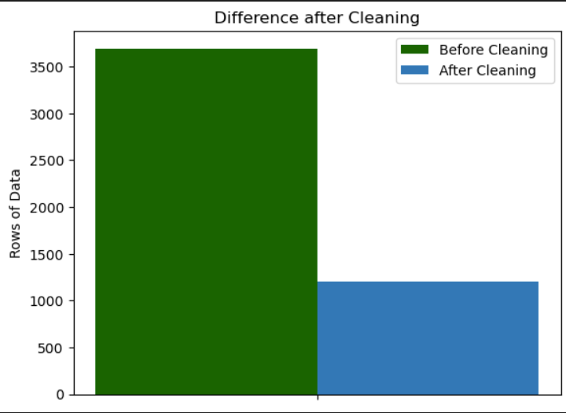

# NTU-SC1015-Mini-Project
School of Computer Science and Engineering
Nanyang Technological University
Lab: B140
Group : 6

Members:

1. Timothy Nyan Lin Htoo
2. Koh Jia Xuan
3. .Wei Tuck
---
#### Description:
##### This repository contains all the Jupyter Notebook and datasets we have used and created as part of the Mini Project for SC1015: Introduction to Data Science and Artificial Intelligence.
##### This README briefly goes through the accomplisment as well as the elaboration of dataset.
---
#### Table of Content
1. Problem Formulation
2. Data Preparation & Cleaning
3. Exploratory Data Analysis
4. Dimensionality Reduction
5. CLustering
6. Data Driven Insights & Conclusion
7. References
---
#### Problem Formulation

Clash Royale has always been a nostalgic game we played as a child, filled with magical characters, thrilling battles, and endless excitement. Whether you're a seasoned player or just starting out, Clash Royale offers a unique and engaging experience that keeps you coming back for more. The pprimary gameplay was simple, challenge player around the word on a 1v1, each player having 8 character cards, the winner wins crowns while the loser loses it. With over 100 over Character Cards with all of them having unique abilities and elixist requirement, it is stragetic game that gives player multiple ways to win the game.

In this projectm, we will be taking a look at player's data to determine what are the key citeria for players to win consistently. We will primirly be taking a look at these quetions.
1. What is the best Deck Combination for winning?
2. Is there a best "broken" Card for winning?
3. Is climbing throphy level difficulty consisted across all arenas?
4. How management of Elixir Leak affect win rate?
5. Does total playtime affect win rates?

#### Data Preparation & Cleaning
Source: https://developer.clashroyale.com/#/documentation
Through the official Royale API, we obtained 960 randomly picked clans with a minimiun clan members of 20, the data which is retrieved through Postman and extracted in the form of JSON. The clan tag were obtained which we then took only 100 clans and retrieved all the players tag in those clans, which we further got individual player details via another API Request Call. This gives us a initial player base of 3695 Player Data.
Of those 3695 player, via their player tag, we also retrieved top 3 recent battle log of all the players.

We proceed to Data Cleaning where we first remove irrelevant Columns, then we proceed to filter out certain players based on the following requirements:
1. Player must have at least played 10 matches
2. Player must play no more than 40,000 matches
3. Player must have a throphy count of more than 1000

Of which, these numberical filter were determined by plotting out box-whisker graph and removing prominent outliers. Once the data were filtered, we were left with 1197 players for our project.

#### Exploratory Data Analysis

#### Dimensionality Reduction

#### Clustering

#### Data Driven Insights & Conclusion

#### References

